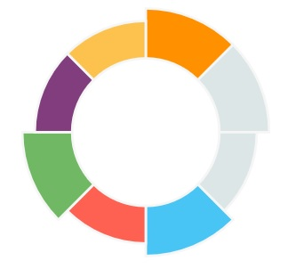

# donut-graph

Under dev

## Example

`<div style="width:200px;height:200px"><svg id="svg"></svg></div>`

```javascript
var graph = DonutGraph.create(document.getElementById('svg'));
var values = [
	{
		value: 1,
		color: '#FF9000',
		active: true
	},
	{
		value: 1,
		color: '#A29AC1',
		disabled: true,
		active: true
	},
	{
		value: 1,
		color: '#3DABAC',
		disabled: true
	},
	{
		value: 1,
		color: '#48C5F5',
		active: true
	},
	{
		value: 1,
		color: '#FE6152'
	},
	{
		value: 1,
		color: '#70B864',
		active: true
	},
	{
		value: 1,
		color: '#823D7E'
	},
	{
		value: 1,
		color: '#FDC24E'
	}
];
graph.setValues(values);
graph.draw();
```



## properties

```javascript
{
	size: 100, // relative size of the graph, no need to change this
	padding: 0, // space around the donut

	outerCircle: {
		backgroundOpacity: 0
	},
	innerCircle: {
		backgroundOpacity: 0
	},
	arc: {
		size: 15,
		borderWidth: 1,
		borderColor: '#F6F6F6'
	},
	disabledArc: {
		backgroundColor: '#DCE6E7',
	},
	activedArc: {
		innerMove: 0,
		outerMove: 5
	}
}
```

## methods

- create()
- setValues(values)
- activeArc(index)
- unactiveArc(index)
- enableArc(index)
- disableArc(index)
- draw()
